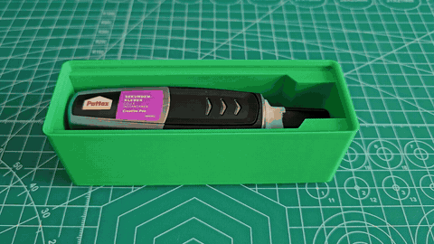
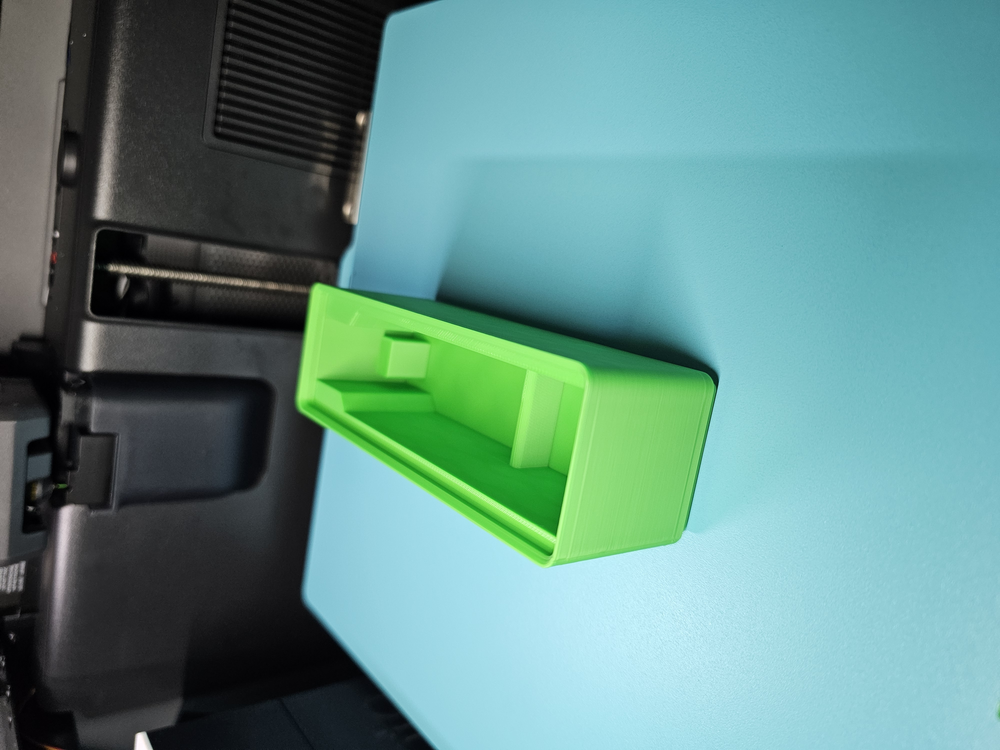
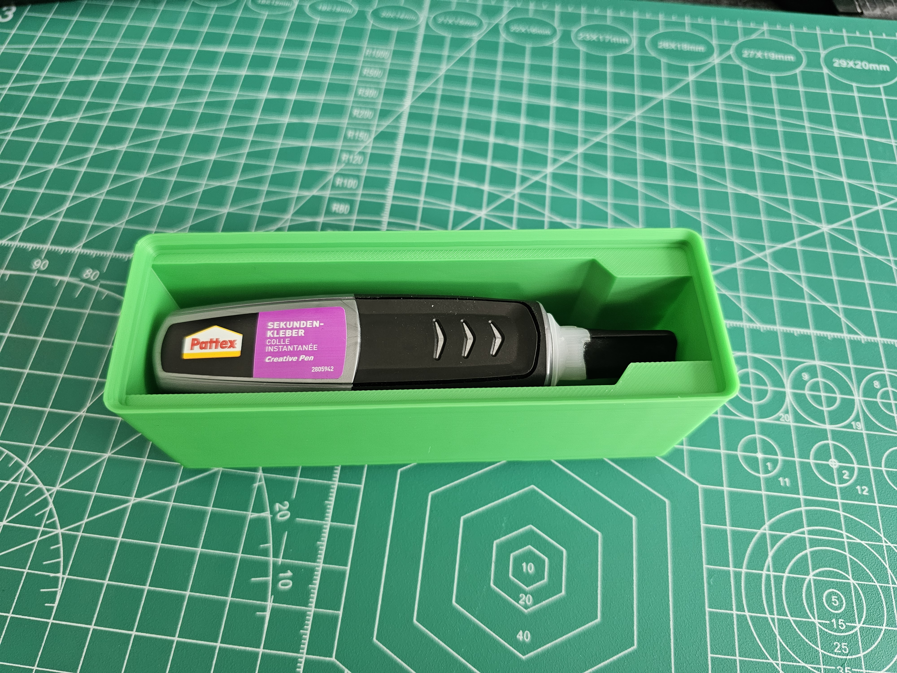
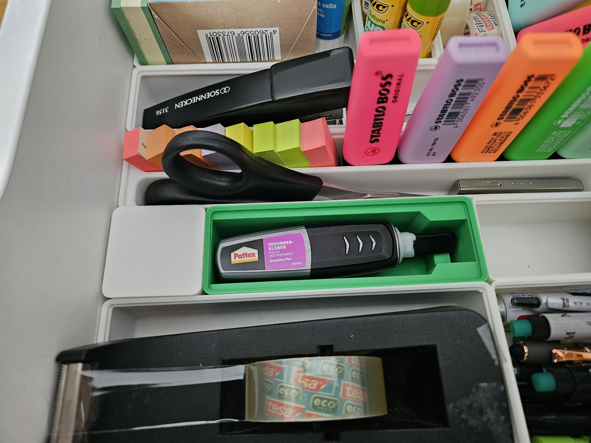
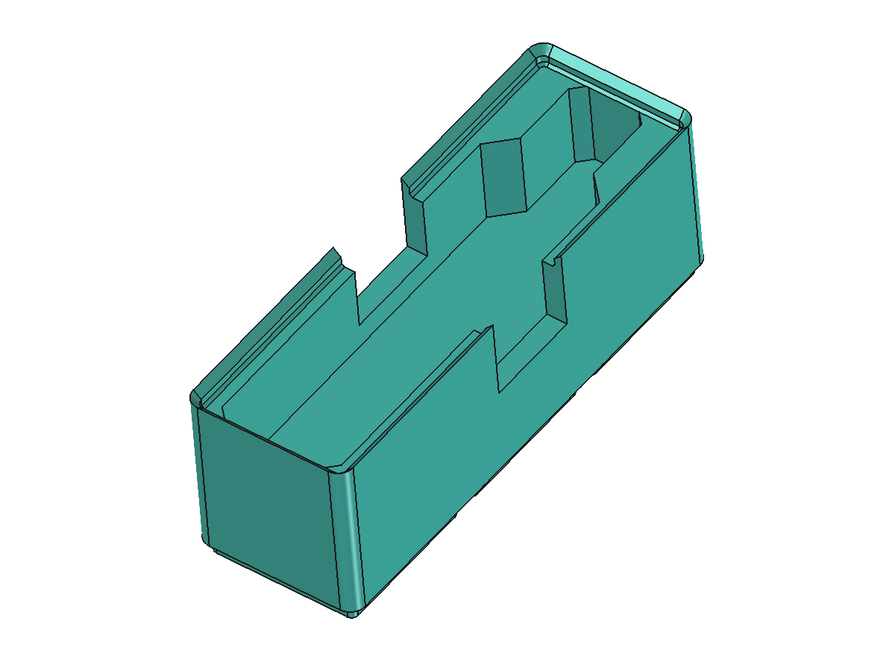
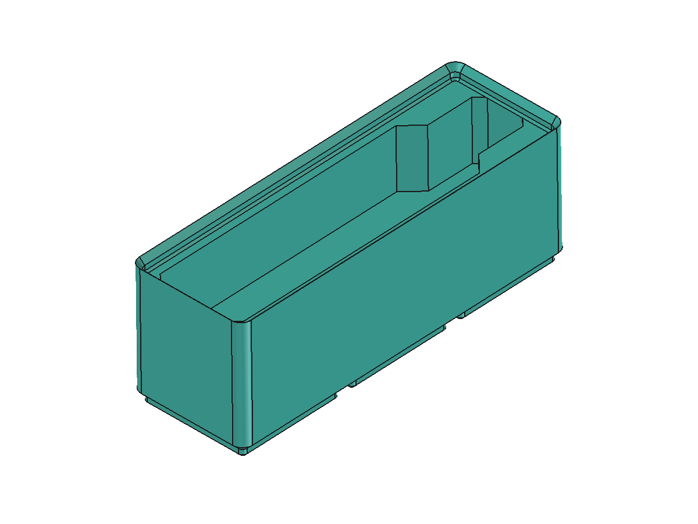
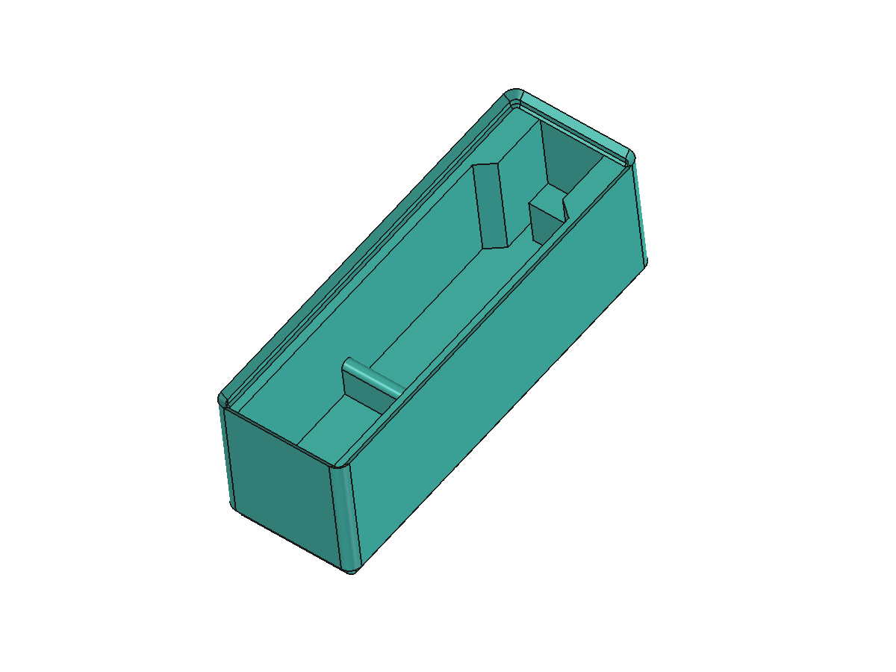
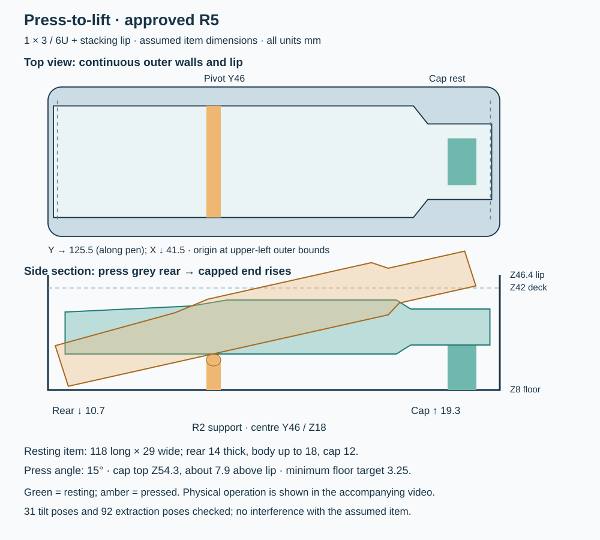

# Gridfinity Designer

**Turn photos and measurements into fitted Gridfinity organizers—with a way to get the item back out.**

A Codex skill for guided measurement, practical pocket design, dimensioned review and CAD generation through a connected FreeCAD MCP server.

[](examples/pattex-pen/video/press-to-lift-demo.mp4)

*From CAD to a real print: press the rear of the pen to raise the capped end for removal. This user-supplied demonstration shows the 1 × 3 organizer in use. [Watch or download the video](examples/pattex-pen/video/press-to-lift-demo.mp4).*

[Install](#install) · [FreeCAD MCP setup](docs/freecad-mcp-setup.md) · [Example walkthrough](examples/pattex-pen/README.md) · [Skill instructions](skills/gridfinity-designer/SKILL.md) · [Design lessons](docs/design-lessons.md)

## What it does

- Uses photos, measurements or supplied CAD to establish orientation and shape.
- Keeps measured dimensions, estimates and prototype assumptions distinct.
- Designs access as part of the pocket: finger recesses, protrusion, removable inserts or press-to-lift support.
- Accounts for Gridfinity feet, stacking lips, height conventions and local floor thickness.
- Shows a dimensioned layout, then implements the approved design and directed revisions.
- Produces FreeCAD, STEP/STL, previews and an honest verification report.
- Helps reduce material for a first fit test without changing the dimensions being tested.

This repository contains the skill and a worked example. It does **not** install FreeCAD, bundle an MCP server or guarantee a physical fit from photographs.

## Install

In Codex, ask the built-in installer:

```text
$skill-installer install https://github.com/mattz1337/gridfinity-designer/tree/main/skills/gridfinity-designer
```

Or copy the complete `skills/gridfinity-designer` directory into a skill location used by your Codex installation. Current documented locations include `~/.agents/skills/` for personal skills and `.agents/skills/` for project skills. If you already have this skill, update that installation rather than creating a duplicate. See the [official skill documentation](https://learn.chatgpt.com/docs/build-skills) for discovery and installation details.

### Requirements

1. Codex with local skill support.
2. FreeCAD and a working FreeCAD MCP connection for model generation.
3. Tool access sufficient to create a document, construct/inspect geometry, save native files and export models.

MCP implementations differ: the skill discovers available tools and checks connectivity instead of assuming a specific server URL or tool schema. Set up your chosen server using its own documentation. A remote server also needs a reachable output location.

Without FreeCAD MCP, the skill can still prepare the measurements, specification and drawings; it reports that no CAD was generated.

### Set up FreeCAD MCP

See the [FreeCAD MCP setup guide](docs/freecad-mcp-setup.md) for addon installation, Codex CLI/configuration examples, a connection check and troubleshooting.

The guide uses [neka-nat/freecad-mcp](https://github.com/neka-nat/freecad-mcp) as a concrete option. It has two components: a FreeCAD addon and an external MCP process launched by your client. Other implementations can work, but their setup and tools may differ. [Upstream quick start](https://github.com/neka-nat/freecad-mcp#quick-start).

## Start a design

```text
Use $gridfinity-designer to organize this item.
It should lie label-up in the smallest practical box.
My other bins are 6U with stacking lips. Keep the outside walls closed.
I print PLA. Photos and approximate measurements are attached.
```

Useful details are item count, storage orientation, approximate dimensions, available space, existing bin/baseplate convention and printer/material. You can provide them gradually. If precise measurements are unavailable, explicitly request a prototype using labeled assumptions.

The first design gets a dimensioned review. After approval, the skill generates and checks it. Clear edits such as “make another version without the side openings” are treated as instructions to implement that variant.

## Worked example: from fitted pocket to press-to-lift

### The printed result

| Freshly printed | Pen seated in the pocket | Installed in the drawer |
|---|---|---|
|  |  |  |

The photographs show the finished organizer and pen fit; the video above demonstrates pressing, removal and replacement. These observations concern this specimen, not dimensional metrology or a durability test.

### The CAD iterations

| First version | Closed sides | Press-to-lift |
|---|---|---|
|  |  |  |
| Easy side access, but unwanted openings. | Continuous walls, but difficult to grip. | Continuous walls plus room beneath the pressed end. |

The example records a real design conversation: approximate measurements corrected a photo estimate; “6U” needed a stacking-lip convention; removing side openings exposed an access problem; a side view and explicitly accepted assumptions enabled the pivot design.



The final example measures **41.5 × 125.5 × 46.4 mm**. Its 42 mm body carries a 4.4 mm lip. A sampled 0–15° tilt test and sampled extraction path had no interference with the **assumed** item model.

**Download:** [STL](examples/pattex-pen/models/press-lift.stl) · [STEP](examples/pattex-pen/models/press-lift.step) · [FreeCAD](examples/pattex-pen/models/press-lift.FCStd)

Read the [full case study](examples/pattex-pen/README.md) for dimensions, assumptions, verification limits, reproducible generation and economical prototype settings.

## Repository layout

```text
skills/gridfinity-designer/   Installable skill, references and templates
examples/pattex-pen/          Case study, models, images, generator and evidence
docs/design-lessons.md       How the workflow improved through actual use
docs/freecad-mcp-setup.md     FreeCAD addon and Codex connection setup
scripts/check_repo.py        Portable package/link/metadata checks
```

The installable skill is small and self-contained; the example and its CAD files are optional.

## Validation and limitations

The example was generated using FreeCAD 1.1.3 through MCP. CAD validity, interface checks and mesh closure are recorded separately from the later user-supplied photos and working demonstration. Exact clearances, removal force and long-term durability have not been measured.

The model has script-generated profiles and dependent boolean features, with editable support primitives. It is not a fully constrained parametric model. The example generator is a reproducibility aid, not a general Gridfinity CAD library.

To check the repository without FreeCAD:

```sh
python scripts/check_repo.py
```

To regenerate and geometrically verify the example, follow its [FreeCAD instructions](examples/pattex-pen/README.md#regenerate-the-example).

## Contributing

Report the actual use case, dimensions, access problem and which checks or prints were performed. Photos and CAD can help; remove personal information before sharing. Prefer improvements demonstrated by real use over adding mandatory steps for every possible organizer.

## License and acknowledgments

[MIT](LICENSE). Gridfinity was created by Zack Freedman. Interface dimensions were checked against [Gridfinity Rebuilt](https://github.com/kennetek/gridfinity-rebuilt-openscad/blob/main/src/core/standard.scad); the case study records the exact verification scope.

Pattex is mentioned to identify the example item. This project is independent of its manufacturer, Bambu Lab, FreeCAD and OpenAI. The example includes CAD views, dimensioned graphics and user-supplied photos/video of the printed result, published with permission. Photo location metadata was removed without changing compressed image data. Earlier measurement photographs and the raw conversation remain omitted.
