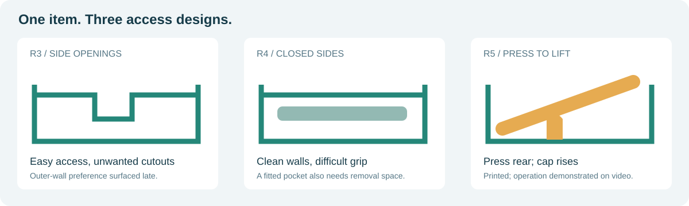
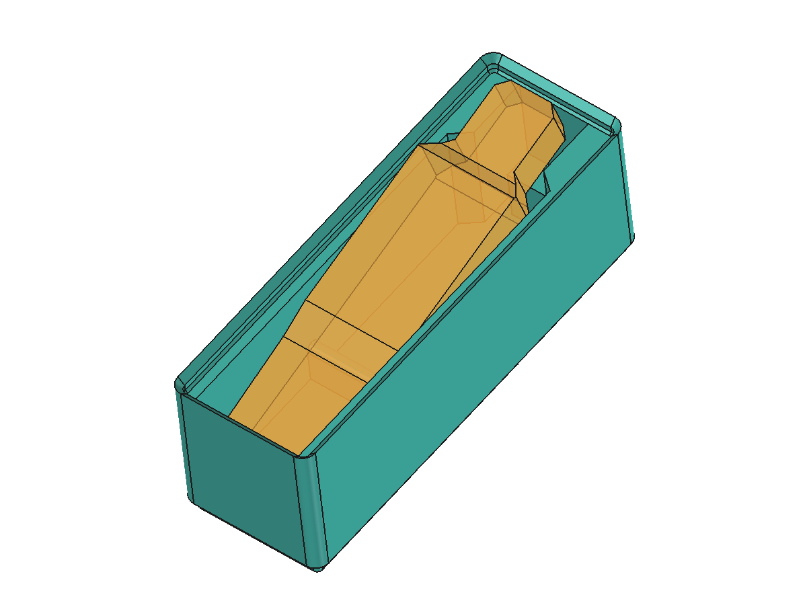

# A fitted pocket that lets go

This example follows a design session for one Pattex adhesive pen stored horizontally, label up. The request was for the smallest practical Gridfinity box, matching existing 6U bins with stacking lips, printed in PLA on a Bambu Lab P2S.

**Status:** Printed and demonstrated. User-supplied photographs show the finished organizer, the actual pen seated in it and its drawer placement. The video demonstrates press-to-lift removal and replacement; quantitative tolerances and durability remain unmeasured.

## The real print

| Fresh off the printer | Fitted with the pen | In the drawer |
|---|---|---|
|  |  |  |

The empty print reveals the transverse rounded support and the small cap rest. The loaded photographs show the pen seated inside the continuous walls and rim.

### Press, lift, replace

[](video/press-to-lift-demo.mp4)

Press the broad rear, grasp the raised cap end, lift the pen out, then return it to the pocket. The supplied clip shows this sequence on the printed specimen.

[Watch or download the 7.8-second MP4](video/press-to-lift-demo.mp4) · 1280 × 720 · approximately 2 MB. The inline GIF is a lower-resolution, silent preview of the same sequence.

This is physical evidence of fit and operation for the shown pen and print. Exact clearance, extraction force, repeat-cycle durability and fit for other pens were not measured. The actual print settings were not supplied; the suggested settings below remain a starting proposal.

## How the design changed

| Revision | Decision | Result |
|---|---|---|
| R3 | Fitted pocket, 6U body, stacking lip, side notches | The user disliked openings through the outer walls. |
| R4 | Remove notches and keep a continuous rim | It became difficult to get fingers around the recessed pen. |
| R5 | Press the broad rear down on a rounded support | The capped end rises above the rim for a grip; outer walls stay closed. |



These are user-directed design choices. R3 and R4 are shown as CAD iterations; the physical demonstration is of the final press-to-lift design. The downloadable model is R5.

## Measurements: what was known, and what was assumed

The initial top photographs included a millimeter grid. Perspective produced a rough 130 mm length estimate. The user then reported **a little under 120 mm long, 30 mm wide and 20 mm thick**. Those direct estimates superseded the photo envelope.

The user later supplied a side view and explicitly asked to continue with assumed measurements. The rocking prototype therefore uses a **118 × 29 mm plan envelope**, with thicknesses of **14 mm at the rear, up to 18 mm at the body, and 12 mm at the cap**. These are deliberate assumptions, not recovered precision measurements. They do not guarantee accommodation of every pen that is merely under 120 × 30 × 20 mm.

A side photo suggested a relatively straight grey casing and a grip area to avoid loading. Its underside and center of mass were not measured.

## The approved mechanism


| Feature | Dimension / position |
|---|---|
| Full-grid footprint | 1 × 3 |
| Overall bounds | 41.5 × 125.5 × 46.4 mm |
| Body deck / stacking lip | Z = 42 / maximum Z = 46.4 mm |
| Main cavity floor | Z = 8 mm; 34 mm below the deck |
| Rounded support | Radius 2 mm; axis along X at Y = 46, Z = 18 |
| Support top | Z = 20 mm |
| Cap rest | X 14.25–27.25; Y 111–119; top Z = 23 mm |
| Broad sidewalls | 5.25 mm |
| Rear / cap-end walls | 1.5 / 2.25 mm |
| Floor above the inter-foot gap | 3.25 mm |

Origin: the outer bounding corner, with X across the bin and Y from broad rear toward cap. Z = 0 is the underside of the feet. The body's outer corner radius is 3.75 mm.


The neutral rear is at Y = 4.75 mm and the cap end at Y = 122.75 mm. Rotating the assumed item 15° around the support axis lowers its rear underside by about **10.7 mm** and places the cap top about **7.9 mm above the lip**.



*Orange is an assumed item envelope used for illustration and checking. It is not part of the printable model.*

At rest, the pen contacts the rounded support and the small cap rest. The intended motion relies on the item's actual weight distribution, friction and casing shape; the support is not a hinge. The verified 15° range is not a calibrated mechanical stop.

### Full contour definition

The cavity polygon is specified in [design.json](design.json), together with the original plan surrogate, side-profile stations, support dimensions and coordinate convention. These make the example reproducible without the private source photographs.

## What was checked

The original generation used FreeCAD 1.1.3 through an MCP connection.

| Check | Recorded outcome |
|---|---|
| Final CAD validity / intended solids | Valid / one |
| Bounds | 41.5 × 125.5 × 46.4 mm |
| Floor and wall sections | Match the dimensions above |
| Virtual upper-bin feet at stacking level Z42 | Zero interference volume |
| Tilt at 0–15°, every 0.5° | Zero interference at all 31 sampled poses |
| Extraction from 15° | Zero interference in 92 sampled positions |
| STEP reimport | Valid, one solid, matching bounds and volume |
| STL | Closed, one connected component, matching numerical bounds |

The checked extraction path first shifts the tilted item **1.5 mm toward the cap and 1 mm upward**, then lifts it 40 mm. That small shift clears the rear stacking lip.

[Original detailed evidence](verification/original-r5.json) · [Verification notes](verification/README.md)

Finite samples are not a continuous swept-volume proof. Zero volume overlap allows contact; it does not prove positive manufacturing clearance. Straight neutral insertion has only about **0.15 mm longitudinal clearance at the cap-side lip throat in the assumed CAD geometry**, so print tolerance matters. The later photos/video demonstrate actual fit and removal for one specimen; baseplate mating tolerance, contact forces, mass balance and removal force were not quantified.

## Download

- [STL](models/press-lift.stl) — import in **millimeters**.
- [STEP](models/press-lift.step).
- [Native FreeCAD](models/press-lift.FCStd).

The model contains script-generated profiles and dependent booleans; the cylinder and support boxes are editable primitives. Changing arbitrary dimensions in a parameter table will not rebuild every profile automatically.

## Regenerate the example

Use FreeCAD 1.1.x with Python, Part, Mesh and MeshPart available. Other versions have not been tested. A normal system Python alone cannot run FreeCAD geometry.

From FreeCAD's Python console, load the script with its actual local path:

```python
import runpy
generator = runpy.run_path("/path/to/gridfinity-designer/examples/pattex-pen/generate.py")
result = generator["generate"]("/path/to/output")
print(result)
```

The function creates a unique run directory and a new document, exports only the organizer, and returns the artifact paths. In GUI mode it also saves a preview. The same function can run in a FreeCAD headless Python environment; GUI-only work is skipped.

To repeat the geometric checks:

```python
checker = runpy.run_path("/path/to/gridfinity-designer/examples/pattex-pen/verify.py")
report = checker["verify"](result["fcstd"], result["step"], result["stl"])
```

These functions do not read the source conversation or original photographs. The generator reproduces this specific approved example; it is not a universal organizer generator.

## Save material on a first print

For this low-load PLA fit test, with an **assumed 0.4 mm nozzle**, the conversation proposed:

| Setting | Starting value |
|---|---|
| Layer height | 0.20 mm |
| Wall loops | 2 |
| Sparse infill | 5% gyroid |
| Top shell | 3 layers / 0.6 mm |
| Bottom shell | 3 layers / 0.6 mm |
| Supports | Off for this feet-down design |
| Brim | None if adhesion is reliable |

These proposed settings were not confirmed as the settings used for the photographed print; they are not a supplied printer profile. Check the sliced floors/supports and compare estimated grams. Minimum shell thickness can override the layer-count setting; adjust both. Higher layer height mainly saves time. Do not scale the part down or use vase mode to test full-size fit and rocking.

## Sources and provenance

- [Gridfinity Rebuilt interface constants](https://github.com/kennetek/gridfinity-rebuilt-openscad/blob/main/src/core/standard.scad), inspected on 2026-09-20. The original session inspected `main` without recording a commit hash; it is a moving reference. The exact dimensions used are preserved in [design.json](design.json).
- [Gridfinity unofficial specification](https://github.com/gridfinity-unofficial/specification), used for general grid context.
- [Bambu shell-setting documentation](https://csm.bblcdn.com/hub/4668d0ca43994ff3bff4b37f1a65c2e7.pdf), supporting the shell-thickness interaction; the actual settings used for the photographed print were not supplied.

Published assets include CAD views, dimensioned drawings, model files and later photos/video of the real print, explicitly supplied by the user for publication. Earlier measurement/room photographs and raw chat remain omitted. Photo location metadata was removed while retaining orientation and original compressed image data. The video was transcoded to H.264/AAC for a smaller MP4, with a silent GIF preview. STEP metadata was neutralized and the native document's license metadata aligned with the repository license; the model geometry was preserved and rechecked.
